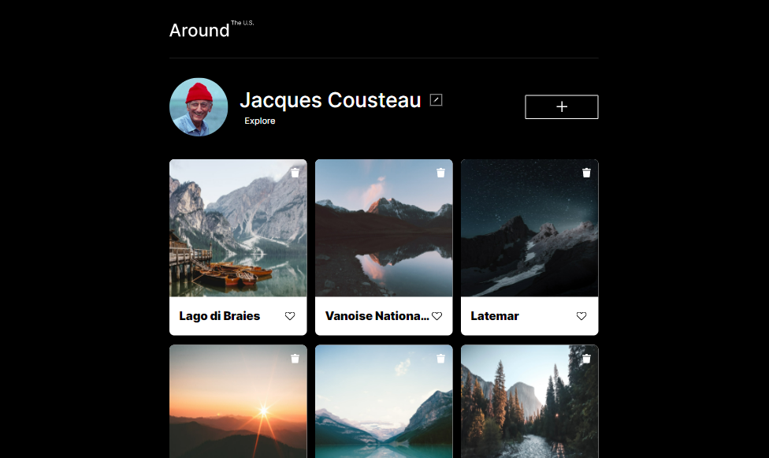
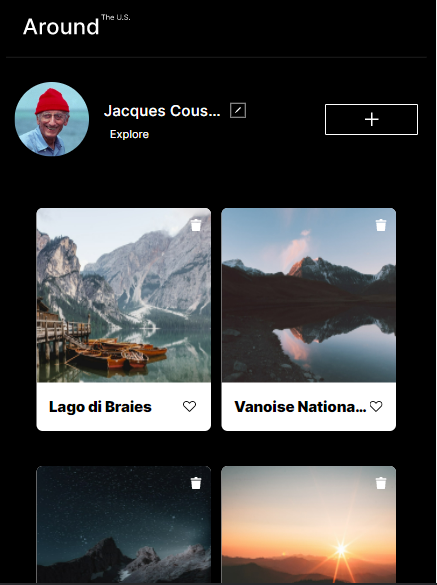
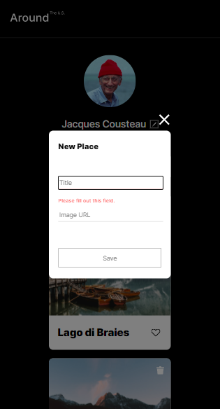

# Project 3: Around The U.S.

### Screenshots of Project

### Overview

- Intro
- Figma
- Images

**Project features**

- Semantic HTML5
- Flexbox
- Positioning
- Flat BEM
- A custom form
- CSS animation and transform

**Intro**

This project is made so all the elements are displayed correctly on popular screen sizes. We recommend investing more time in completing this project, since it's more difficult than previous ones.

**Project demo on Youtube**

- [Link to the project on demo on Youtube](https://youtu.be/Zlr-f1dt7UQ)

**Github**

- [Link to the project on Github](https://github.com/rezamohdev/se_project_aroundtheus)

**Figma**

- [Link to the project on Figma](https://www.figma.com/file/ii4xxsJ0ghevUOcssTlHZv/Sprint-3%3A-Around-the-US?node-id=0%3A1)

**Page deployed on github live**

- [Link to the doployed page on github](https://rezamohdev.github.io/se_project_aroundtheus/)

**Images**

The way you'll do this at work is by exporting images directly from Figma — we recommend doing that to practice more. Don't forget to optimize them [here](https://tinypng.com/), so your project loads faster.

**Plan on improving the project**

From a simple static page, step by step We'll add more functionality to next versions, from different UI component to a fully functional and dynamic website.

Good luck and have fun!
